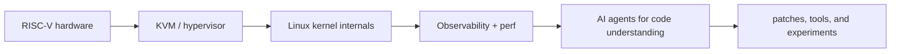

<div align="center">

<pre><code>
zcxGGmu@github:~$ ./boot --kernel riscv --hypervisor kvm --agent llm

[ OK ] loading low-level systems
[ OK ] mapping virtual memory, guests, and traps
[ OK ] wiring agents that can read, reason, and ship

status: building at the boundary of kernels, hypervisors, and AI systems
</code></pre>

<h3>Hypervisor / Linux Kernel / LLM Systems</h3>

<p>
  I like the layers where software becomes physical:<br>
  hardware &lt;-&gt; hypervisor | kernel &lt;-&gt; userspace | language models &lt;-&gt; tools
</p>

<p>
  <a href="https://github.com/zcxGGmu?tab=repositories&q=&type=&language=c&sort="></a>
  <a href="https://github.com/zcxGGmu?tab=repositories&q=&type=&language=rust&sort="></a>
  <a href="https://github.com/zcxGGmu?tab=repositories&q=&type=&language=typescript&sort="></a>
  <a href="https://github.com/zcxGGmu?tab=repositories&q=&type=&language=python&sort="></a>
</p>

</div>

---

### `kernel.log`

```text
current focus
|- RISC-V KVM: perf, extensions, dirty logging, nested virtualization
|- Ferrovisor: memory-safe type-1 hypervisor experiments in Rust
|- Linux internals: guests, VMIDs, gstage mapping, IOMMU paths
\- AI agents: code intelligence, open-source contribution loops, tool use
```

### Selected work

| Area | Project | Notes |
| --- | --- | --- |
| Hypervisor | [Ferrovisor](https://github.com/zcxGGmu/Ferrovisor) | Memory-safe, high-performance type-1 hypervisor built in Rust |
| Linux / RISC-V | [linux-riscv](https://github.com/zcxGGmu/linux-riscv) | Linux kernel source tree and RISC-V exploration |
| KVM / RISC-V | [kvm-riscv](https://github.com/zcxGGmu/kvm-riscv) | Linux KVM RISC-V workspace |
| AI agents | [Astraeus](https://github.com/zcxGGmu/Astraeus) | Platform for autonomous AI agents |
| OSS agents | [CodeInsights](https://github.com/zcxGGmu/CodeInsights) | LLM-powered multi-agent platform for open-source contributions |
| LLM systems | [TinyLLMInfer-rs](https://github.com/zcxGGmu/TinyLLMInfer-rs) | Small Rust inference engine experiment |

### Patch trail

- [riscv: Add perf support to collect KVM guest statistics from host side](https://lore.kernel.org/all/cover.1728980031.git.zhouquan@iscas.ac.cn/)
- [RISC-V: perf/kvm: Add reporting of interrupt events](https://lore.kernel.org/all/9693132df4d0f857b8be3a75750c36b40213fcc0.1726211632.git.zhouquan@iscas.ac.cn/)
- [RISC-V: KVM: Enable ring-based dirty memory tracking](https://lore.kernel.org/all/cover.1749810735.git.zhouquan@iscas.ac.cn/)
- [RISC-V: KVM: Add Zicfiss/Zicfilp support](https://lore.kernel.org/all/cover.1764509485.git.zhouquan@iscas.ac.cn/)
- [KVM: riscv: Support enabling dirty log gradually in small chunks](https://lore.kernel.org/all/20251103062825.9084-1-dayss1224@gmail.com/)

### System map



### Toolchain

```text
systems     C · Rust · Linux · KVM · RISC-V · QEMU
agents      TypeScript · Python · LLM tooling · automation
interests   virtualization · memory safety · kernel observability · OSS workflows
```

---

<div align="center">

<picture>
  <source media="(prefers-color-scheme: dark)" srcset="https://raw.githubusercontent.com/zcxGGmu/zcxGGmu/output/github-contribution-grid-snake-dark.svg">
  <source media="(prefers-color-scheme: light)" srcset="https://raw.githubusercontent.com/zcxGGmu/zcxGGmu/output/github-contribution-grid-snake.svg">
  
</picture>

<pre><code>
keep the stack small, the feedback loop tight, and the abstractions honest
</code></pre>

</div>
